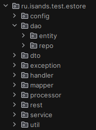
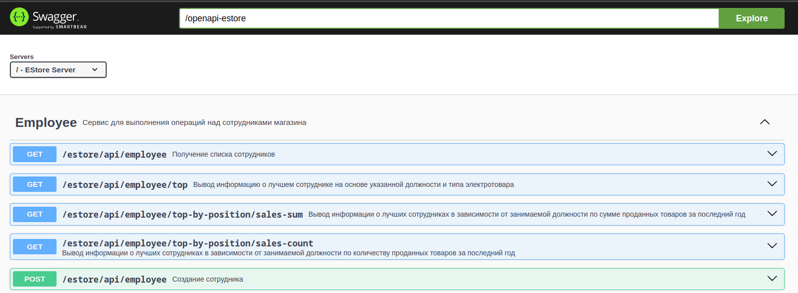
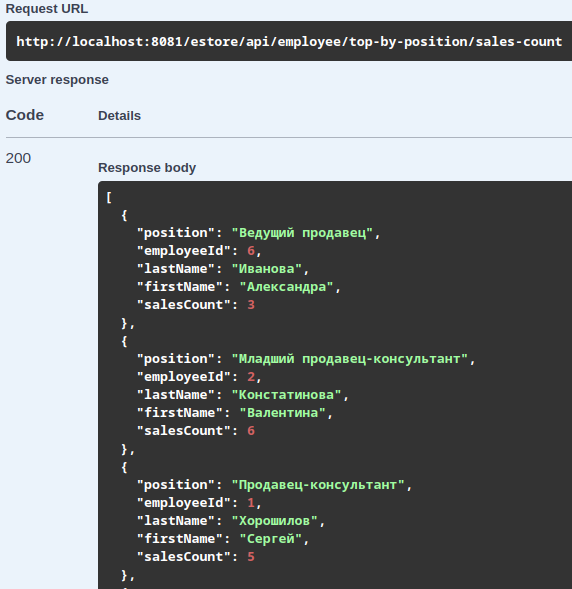
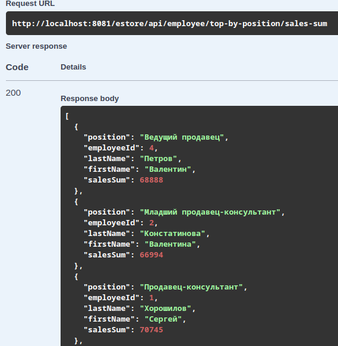
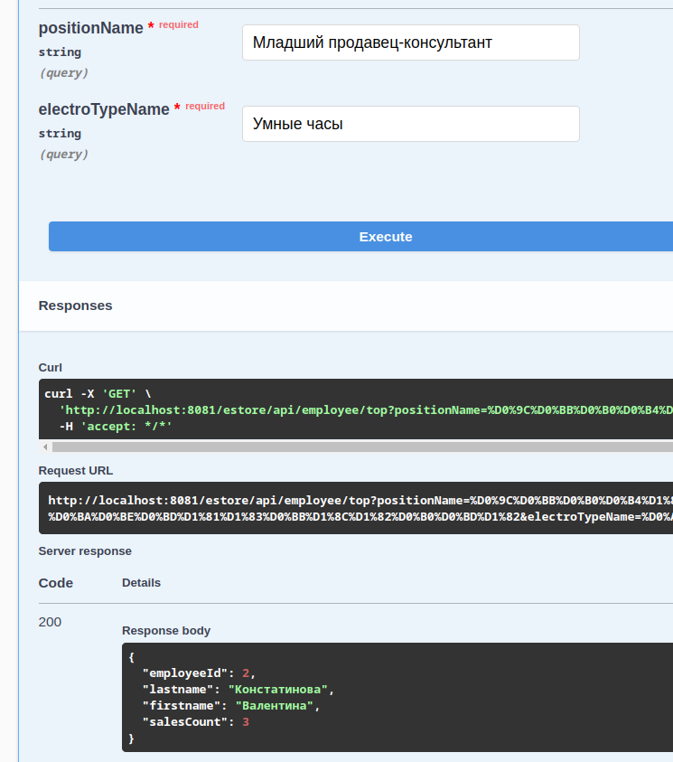
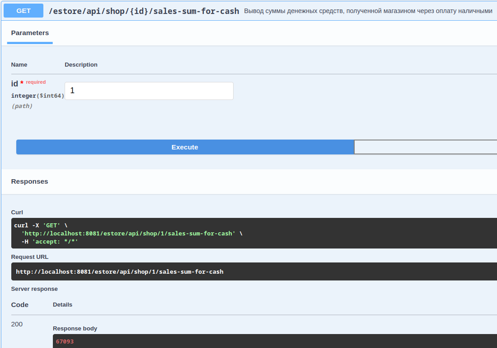

# Тестовое задание от компании "Информационные системы и сервисы"

Необходимо написать приложение на базе микросервисной архитектуре с разделением на backend и frontend части

## Технологический стек :

- Язык программирования: Java 11
- Frameworks: Spring Boot Starter (2.7), Spring Web, Spring JPA, Spring Hibernate;
- База данных: PostgreSQL;
- Библиотека для генерации документации: springdoc-openapi

## Структура проекта



- _config_: Классы конфигурации: например, веб-конфигурация приложения
- _dao_:
    - _entity_: Классы моделей сущностей
    - _repo_: Классы репозиториев
- _dto_: Классы объектов передачи данных (DTO). Используются для взаимодейстивия с клиентским приложением
- _exception_: В данном пакете определены пользовательские исключения, используемые в приложения
- _handler_: Обработчик исключений
- _mapper_: Классы мапперов для сущностей и DTO
- _processor_: Классы обработчики csv-файлов
- _rest_: Классы контроллеров
- _services_: Классы сервисов, выполняющих основную бизнес-логику
- _util_: Вспомогательные классы

## Инструкция по установке

Для сборки необходимо:

- Java 11
- Maven
- База данных в Postgresql

Для запуска необходимо:

- Склонировать проект

```bash
git clone git@github.com:pxlhack/estore-microservice.git
```

- Отредактировать файл [application.properties](src/main/resources/application.properties)

```properties
spring.datasource.url={url бд}
spring.datasource.username={имя пользователя}
spring.datasource.password={пароль}
```

- Перейти в директорию проекта и запустить его

```bash
cd estore-microservice/
mvn spring-boot:run
```

## API документация

- Ссылка на Swagger UI:  http://localhost:8081/swagger-ui/index.html#/
- Swagger UI:
  

## Доп функционал

Приложение также должно содержать доп. функционал, для этого необходимо:

1. Реализовать вывод информации о лучших сотрудниках в зависимости от занимаемой должности по следующим критериям:

- Количество проданных товаров за последний год. <br>
   <br>
- Сумма проданных товаров. Прописать обозначения за последний год. <br>
   <br>

2. Реализовать вывод информации по определенным критериям:

- вывод лучшего младшего продавца-консультанта, продавшего больше всех умных часов;<br>
   <br>
- вывод суммы денежных средств, полученной магазином через оплату наличными. <br>
   <br>
